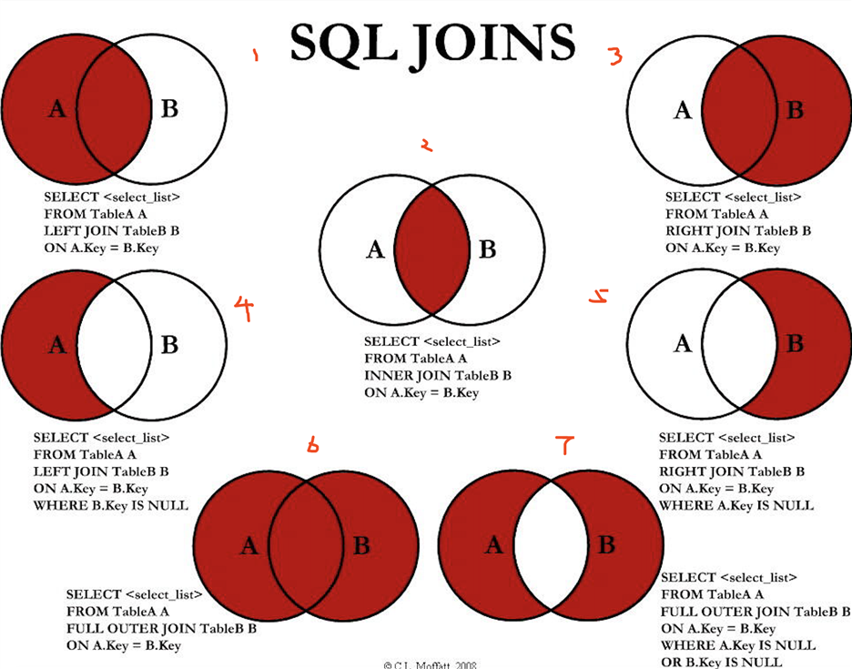

# sql语句优化1

## 瓶颈
CPU:读写数据
IO:磁盘操作频繁
服务器性能:硬件

## sql执行顺序
FROM  
ON  
JOIN  
WHERE  
GROUP BY  
HAVING   
SELECT  
DISTINCT  
ORDER BY  
LIMIT
  
## 7种join
那边连接，就将那边的全部内容放到查询范围里

## 索引
帮助mysql高效获取数据的数据结构
索引本身可能很大,因此作为文件放在磁盘中
索引也是一张表,它保存了主键和索引字段并指向实体的记录(类似指针)

哈希索引
B树索引
全文索引
R树索引

聚集索引、次要索引、覆盖索引、复合索引、前缀索引，唯一索引默认为B+树

索引提高了检索效率,降低IO成本，降低排序成本，降低cpu消耗
但降低更新表的速度,占用了很多空间,大数据量的表需要研究选择哪项作为索引

索引类型
单值索引:单列,可以有多个
唯一索引:索引列的值必须唯一，但允许为空
复合索引:多列

那些情况建议建索引
主键
频繁查找
外键查找
高并发一般使用复合索引
统计或分组字段

那些情况不建议建索引
表记录少
表数据很多重复内容
频繁更新
where用不到

## B+树

