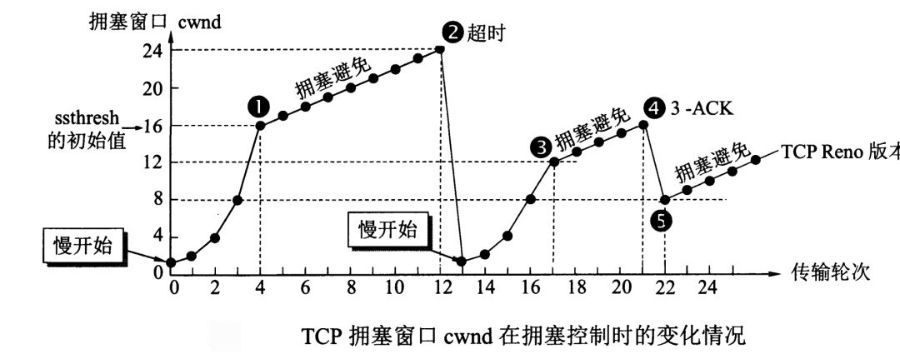

# TCP/UDP

## UDP
无连接不可靠，没有流量控制堵塞控制，尽最大可能交付，面向报文，支持一对一、一对多、多对多，也不差分也不合并只添加首部

UDP不存在粘包和拆包，因为其首部有长度信息

## TCP
面向连接可靠，有流量控制堵塞控制，全双工，一对一，把报文看成字节流，差分成数据块

### 三次握手
客户端发送连接请求，携带SYN标志
服务端应答，是否收到客户端请求同时向客户端发起请求，携带ACK，SYN
客户端应答，是否收到服务端请求同时携带ACK，SYN

目的：
第一次握手：服务端知道客户端发送和接收没问题   
第二次握手：客户端知道服务端发送和接收、客户端的发送和接受   
第三次握手：服务端和客户端都知道自己的发送和接收没问题  
例子:客户端第一次连接请求在网络中堵塞，于是客户端超时重传，连接成功并在传输数据完成后释放连接，这个时候连接请求到达了服务端，如果使用两次握手会导致服务端以为客户端重新发送了请求导致资源浪费。　　

### 发送数据

滑动窗口最左面是未被确认的第一个数据，如果确认则往前滑动

### 堵塞控制

慢开始和拥塞避免

设发送报文段为X,门限值为T

慢开始：令X=1，如果接收成功则下次发送X*=2，这样在一段时间后增速会很快，因此设置一个门限((拥塞避免))，大于等于门限则将X+=1，如果超时，T=X/2，在重新执行慢开始

快重传和快恢复

当丢失个别报文段时，发送方收到前一个包的三个重复确认，使用快重传发送这个包，同时，启动快恢复，将T=X/2,X=T,进入拥塞避免

### 粘包和拆包
发送的数据大小大于缓冲区剩余空间会发生拆包
发送的数据大小大于最大报文长度会发生拆包
发送的数据大小小于缓冲区剩余空间将多个包合并发生粘包
应用层没有及时读取数据导致粘包

解决方法：
消息定长
设置消息边界
添加长度信息字段

### 四次握手
客户端发送关闭请求，携带FIN标志  
服务端应答关闭请求，携带ACK应答(完成这一步处于半关闭状态)  
服务端发送关闭请求，携带FIN标志  
客户端应答关闭请求，携带ACK应答  

第四次握手时客户端会等待2个最长报文段寿命(MSL)的时间保证ACK报文到达服务端

半关闭：一端告诉另一端已经完成了数据的发送，只能接受数据，直到另一端也发送关闭请求

当服务端得到FIN报文可能还没有发送完所有报文，因此只能告诉客户端我收到了，直到所有报文发送完才能发送FIN

## TCP字段含义

### MTU、MSS、MSL
MTU:最大传输单元，即物理接口（数据链路层）提供给其上层（通常是IP层）最大一次传输数据的大小  
MSS:TCP提交给IP层最大分段大小，不包含TCP Header和 TCP Option，只包含TCP Payload ，MSS是TCP用来限制application层最大的发送字节数  
MSL:任何报文在网络上存在的最长的最长时间，超过这个时间报文将被丢弃，由IP头部的TTL实现

### RECV-Q
LISTEN状态:
全连接队列的大小

非LISTEN状态:
收到的数据，但还没有被使用的字节数

### SEND-Q
LISTEN状态:
当前全连接队列最大长度

非LISTEN状态:
已发送但没有被确认的字节数

## RST
rst标识复位，用来异常的关闭连接。发生时会直接丢失缓冲区数据，发送给接受端也不用ack确认

tcp产生rst的几种情况
1. 目的端口未监听
2. 目的主机或网络途径中有防火墙拦截
3. RECV-Q的数据未完全读取，就close
4. 已关闭的socket发送数据

## 使用TCP

### 改善一
错误的发送方:send+close，即可能产生第三种产生rst的情况，数据丢失

解决方法:  
正确的发送方:send+shutdown(write)+    read返回0+close
                    ↓                 ↑
正确的接收方:     read返回0+没有数据发送+close

### 改善二
SIGPIPE，对已经关闭的管道写数据会收到SIGPIPE信号终止进程
在网络编程中一般将这个信号忽略，并检查与其相关的读写的返回值

### 该三三
Nagle算法
一个TCP连接的任何时刻，都最多有一个未被确认(发出但没有得到ACK)的数据块(长度小于等于MSS)，如果超时立即发送。将能合并的块合并成一个数据块，以此避免许多小数据块的发送，但提高了延迟。

降低延迟方法:
开启TCP_NODELAY或TCP_CORK
自己把内容合并再发出去

### 改善四
复用地址，开启SO_REUSEADDR

## 指令

### 监听某个端口
sudo tcpdump -l any tcp port 60000 -nn